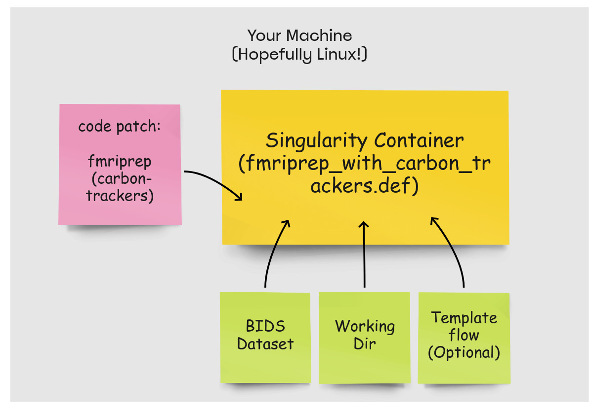

# Stand-in readme for carbon trackers usage with fmriprep. (This should be merged with official docs after PR). 

## Goal: track power consumption (i.e. cpu power draws) of fmriprep workflow using [CodeCarbon](https://mlco2.github.io/codecarbon/index.html)
This fmriprep feature is being develped by [OHBM SEA-SIG – Sustainabilicarbontracker/figs/fmriprep_carbontracker.jpgty & Environmental Action Group](https://ohbm-environment.org/) in efforts to assess and reduce carbon footprint of neuroimaging pipelines.


## Current dependencies
1. [fmriprep: v22.0.0 (carbon-trackers branch)](https://github.com/nikhil153/fmriprep/tree/carbon-trackers)
2. [CodeCarbon: v2.1.3](https://mlco2.github.io/codecarbon/index.html)

## Code 
### files modified:
1. fmriprep/cli/parser.py
2. fmriprep/cli/run.py
3. fmriprep/config.py

### Files added in fmriprep/carbontracker
├── emissions_demo.csv
├── emissions_visual_demo.ipynb
├── figs
│   ├── CodeCarbon_example_emissions.png
│   ├── CodeCarbon_example_global.png
│   ├── fmriprep_carbontracker.jpg
│   └── sea-sig_logo.png
├── fmriprep_with_carbon_trackers.def
├── README.rst
├── requirements.txt
├── run_fmriprep_patch.sh


## Setup (see figure below)
- Env: Singularity container 
        - fmriprep: v22.0.0
        - CodeCarbon: v2.1.3




## Setup instructions
1. Clone this [repo](https://github.com/nikhil153/fmriprep/tree/carbon-trackers) and checkout "carbon-trackers" branch

```
cd <path-to-code-dirs>
git clone https://github.com/nikhil153/fmriprep.git
cd fmriprep 
git checkout carbon-trackers
```

2. Build singularity image from [fmriprep_with_carbon_trackers.def](./fmriprep_with_carbon_trackers.def) to include [CodeCarbon](https://mlco2.github.io/codecarbon/index.html) dependencies. 

```
cd <path-to-code-dirs>/fmriprep/carbontracker
sudo singularity build <path-to-container-dir>/fmriprep_with_codecarbon.sif fmriprep_with_carbontrackers.def
```

3. Run [run_fmriprep_patch.sh](../scripts/run_fmriprep_patch.sh). You will need to provide following arguments:
- BIDS dir (`-b`): input for fmriprep
- working dir (`-w`): directory for fmriprep processing
- subject ID (`-s`): subject subdirectory inside BIDS_DIR
- fmriprep code dir (`-f`): directory for local fmriprep code (carbon-trackers branch)
- container (`-c`): singularity container with carbon tracker packages and dependencies
- geolocation (`-g`): country code used by CodeCarbon to estimate emissions e.g. "CAN"
- templateflow (`-t`): templateflow dir (optional)


```
example cmd: 
sudo ./run_fmriprep_patch.sh \
        -b ~/scratch/test_data/bids \
        -w ~/scratch/test_data/derivatives \
        -s 001 \
        -f ~/scratch/my_repos/fmriprep/fmriprep \
        -c ~/scratch/my_containers/fmriprep_with_codecarbon.sif \
        -g "CAN" \
        -t ~/scratch/templateflow

```

4. Output will be stored in a `<working dir>/output/emissions.csv`

### emissions.csv

| cloud_provider | cloud_region | country_iso_code | country_name | cpu_count | cpu_energy            | cpu_model                                | cpu_power          | duration           | emissions              | emissions_rate        | energy_consumed        | gpu_count | gpu_energy | gpu_model | gpu_power | latitude | longitude | on_cloud | os                                                      | project_name | python_version | ram_energy            | ram_power         | ram_total_size    | region | run_id                               | timestamp           | tracking_mode |
|----------------|--------------|------------------|--------------|-----------|-----------------------|------------------------------------------|--------------------|--------------------|------------------------|-----------------------|------------------------|-----------|------------|-----------|-----------|----------|-----------|----------|---------------------------------------------------------|--------------|----------------|-----------------------|-------------------|-------------------|--------|--------------------------------------|---------------------|---------------|
|                |              | CAN              | Canada       | 8         | 0.00012 | Intel(R) Core(TM) i7-8650U CPU @ 1.90GHz | 12.60793 | 37.45153 | 2.80218e-05 | 0.00074 | 0.00021 |           | 0          |           | 0.0       |          |           | N        | Linux-4.15.0-144-generic-x86_64-with-debian-stretch-sid | codecarbon   | 3.7.1          | 9.0859e-05 | 8.73427 | 23.29138 |        | 9982d15a-f5fc-41c5-95e6-d04c9b993b4b | 2022-06-11T22:54:34 | machine       |


### visuals
|Emissions equivalents|Global comparisons|
|----------------|--------------|
|  |  |

## known issues
1. [Unable to read Intel RAPL files for CPU power](https://github.com/mlco2/codecarbon/issues/244): This is related to linux permission and requires a work around described in the link. Otherwise CPU power is reported as zero and total emissions are calcuated using a fix estimate. 
